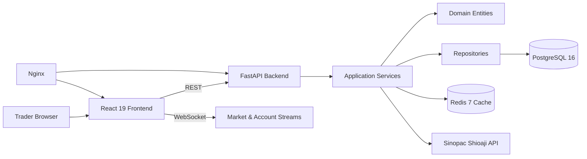

# Taiwan Tradovate (TTX Trader)

Taiwan Tradovate (TTX Trader) is a professional TAIFEX futures trading platform that recreates a Tradovate-style workflow for Taiwan futures using Sinopac Shioaji. The repository is implemented incrementally across ten reviewed phases.

> Phase 2 status: Shioaji authentication, CA activation, connection status, reconnect management, health checks, and account endpoint are implemented and tested.

## Architecture



## Planned Capabilities

- Real-time tick and bid/ask market data.
- Historical K-bar data with Redis caching and interval aggregation.
- Multi-chart workspace with TradingView Lightweight Charts v5.
- Chart trading, DOM ladder trading, drag-and-drop order management.
- OCO brackets, ATM templates, risk checks, and position management.

## Repository Layout

See [`docs/repository-tree.md`](docs/repository-tree.md) for the complete target tree and Phase 1 implemented scaffold.

## Quick Start

### Backend

```bash
cd backend
python -m venv .venv
source .venv/bin/activate
pip install -e '.[dev]'
pytest
uvicorn app.main:app --reload
```

### Frontend

```bash
cd frontend
npm install
npm run dev
npm test
```

### Docker

```bash
cp .env.example .env
docker compose up --build
```

## Environment Setup

All credentials are read only from environment variables. Never hardcode Shioaji secrets.

Required Shioaji variables:

```dotenv
SHIOAJI_API_KEY=
SHIOAJI_SECRET_KEY=
SHIOAJI_PERSON_ID=
SHIOAJI_CA_PATH=
SHIOAJI_CA_PASSWORD=
```

## API Preview

The REST and WebSocket contract is documented in [`docs/api-specification.md`](docs/api-specification.md). Phase 1 exposes:

```bash
curl http://localhost:8000/health
curl http://localhost:8000/api/v1/health
```

Phase 2 adds account status and health checks. Future phases add market history, streaming, orders, positions, executions, and ATM template endpoints.

## Database Schema

The planned relational schema is documented in [`docs/database-schema.md`](docs/database-schema.md). Alembic is scaffolded in `backend/migrations` for later migration phases.

## Development Phases

The implementation roadmap is documented in [`docs/implementation-plan.md`](docs/implementation-plan.md). Each phase produces code, tests, a commit, and then pauses for review.

## Shioaji Setup Notes

1. Open a Sinopac account and enable API trading.
2. Store API key, secret key, person ID, CA path, and CA password in `.env` only.
3. Mount the CA certificate into the backend container in production.
4. Phase 2 implements automatic login, CA activation, session lifecycle management, and reconnect within five seconds.


## Authentication Setup

Phase 2 implements `AuthenticationService`, a Shioaji SDK adapter, CA activation, reconnect handling, and a 10-second background connection monitor. The backend automatically logs in during startup when the required Shioaji environment variables are present. If credentials are omitted in local development, startup continues and logs `shioaji_startup_login_skipped`.

Required variables are loaded from the process environment or `.env`:

```dotenv
SHIOAJI_API_KEY=your-api-key
SHIOAJI_SECRET_KEY=your-secret-key
SHIOAJI_PERSON_ID=your-person-id
SHIOAJI_CA_PATH=/secure/certs/Sinopac.pfx
SHIOAJI_CA_PASSWORD=your-ca-password
```

### CA Configuration

- Store the CA certificate outside the repository.
- Set `SHIOAJI_CA_PATH` to the absolute path inside the backend runtime or container.
- Mount production CA material as a secret or read-only volume; never commit certificates or passwords.
- The service validates that the CA file exists and that the CA password and person ID are present before activation.

### Connection Management

Reconnect attempts are logged with Structlog and use this retry schedule: immediate, 5 seconds, 15 seconds, 30 seconds, and 30 seconds. If all five attempts fail, the backend raises `ConnectionLostException`. Successful reconnects automatically reload Shioaji contracts.

### Account and Health Endpoints

```bash
curl http://localhost:8000/account
curl http://localhost:8000/api/v1/account
curl http://localhost:8000/health
curl http://localhost:8000/api/v1/health
```

Account response:

```json
{
  "connected": true,
  "account_id": "",
  "broker": "Sinopac",
  "person_id": "",
  "contracts_loaded": true
}
```

Health response:

```json
{
  "status": "healthy",
  "shioaji_connected": true,
  "redis_connected": true,
  "database_connected": true
}
```

### Troubleshooting Guide

- `Missing Shioaji credentials`: verify all required `SHIOAJI_*` variables are set in `.env` or the runtime environment.
- `Shioaji CA certificate file does not exist`: confirm the certificate path exists inside the backend container, not only on the host.
- `Shioaji CA activation failed`: verify the CA password and person ID match the certificate owner.
- `Shioaji connection could not be restored`: check network connectivity to Sinopac, API key permissions, and broker service availability.
- Health status `degraded`: inspect `shioaji_connected`, `redis_connected`, and `database_connected` fields to identify the failing dependency.

## Examples Planned for Later Phases

Historical data:

```bash
curl 'http://localhost:8000/api/v1/market/history?symbol=TXF&interval=1m'
```

WebSocket market stream:

```javascript
const ws = new WebSocket('ws://localhost:8000/ws/market/TXF');
ws.onmessage = (event) => console.log(JSON.parse(event.data));
```

Order entry:

```bash
curl -X POST http://localhost:8000/api/v1/orders \
  -H 'Content-Type: application/json' \
  -d '{"symbol":"TXF","side":"buy","quantity":1,"price":22000}'
```

ATM template:

```bash
curl -X POST http://localhost:8000/api/v1/atm-templates \
  -H 'Content-Type: application/json' \
  -d '{"name":"Scalp","stop_loss_ticks":10,"take_profit_ticks":20}'
```

## Roadmap

- Phase 2: Shioaji authentication and session management. ✅
- Phase 3: Historical market data and aggregation.
- Phase 4: Real-time market streaming.
- Phase 5: Multi-chart workspace and real-time updates.
- Phase 6: Tradovate-style DOM ladder.
- Phase 7: Order execution and management.
- Phase 8: Chart trading and drag management.
- Phase 9: ATM strategies and risk controls.
- Phase 10: Deployment hardening, final documentation, and full integration coverage.
