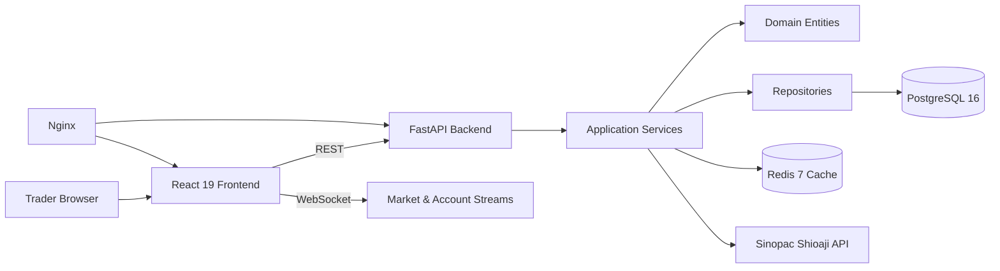

# Taiwan Tradovate (TTX Trader)

Taiwan Tradovate (TTX Trader) is a professional TAIFEX futures trading platform that recreates a Tradovate-style workflow for Taiwan futures using Sinopac Shioaji. The repository is implemented incrementally across ten reviewed phases.

> Phase 1 status: production-grade project scaffold, CI, typed backend/frontend foundations, architecture documentation, and baseline tests.

## Architecture



## Planned Capabilities

- Real-time tick and bid/ask market data.
- Historical K-bar data with Redis caching and interval aggregation.
- Multi-chart workspace with TradingView Lightweight Charts v5.
- Chart trading, DOM ladder trading, drag-and-drop order management.
- OCO brackets, ATM templates, risk checks, and position management.

## Repository Layout

See [`docs/repository-tree.md`](docs/repository-tree.md) for the complete target tree and Phase 1 implemented scaffold.

## Quick Start

### Backend

```bash
cd backend
python -m venv .venv
source .venv/bin/activate
pip install -e '.[dev]'
pytest
uvicorn app.main:app --reload
```

### Frontend

```bash
cd frontend
npm install
npm run dev
npm test
```

### Docker

```bash
cp .env.example .env
docker compose up --build
```

## Environment Setup

All credentials are read only from environment variables. Never hardcode Shioaji secrets.

Required Shioaji variables:

```dotenv
SHIOAJI_API_KEY=
SHIOAJI_SECRET_KEY=
SHIOAJI_PERSON_ID=
SHIOAJI_CA_PATH=
SHIOAJI_CA_PASSWORD=
```

## API Preview

The REST and WebSocket contract is documented in [`docs/api-specification.md`](docs/api-specification.md). Phase 1 exposes:

```bash
curl http://localhost:8000/health
curl http://localhost:8000/api/v1/health
```

Future phases add market history, streaming, orders, positions, executions, account, and ATM template endpoints.

## Database Schema

The planned relational schema is documented in [`docs/database-schema.md`](docs/database-schema.md). Alembic is scaffolded in `backend/migrations` for later migration phases.

## Development Phases

The implementation roadmap is documented in [`docs/implementation-plan.md`](docs/implementation-plan.md). Each phase produces code, tests, a commit, and then pauses for review.

## Shioaji Setup Notes

1. Open a Sinopac account and enable API trading.
2. Store API key, secret key, person ID, CA path, and CA password in `.env` only.
3. Mount the CA certificate into the backend container in production.
4. Phase 2 implements automatic login, CA activation, session lifecycle management, and reconnect within five seconds.

## Examples Planned for Later Phases

Historical data:

```bash
curl 'http://localhost:8000/api/v1/market/history?symbol=TXF&interval=1m'
```

WebSocket market stream:

```javascript
const ws = new WebSocket('ws://localhost:8000/ws/market/TXF');
ws.onmessage = (event) => console.log(JSON.parse(event.data));
```

Order entry:

```bash
curl -X POST http://localhost:8000/api/v1/orders \
  -H 'Content-Type: application/json' \
  -d '{"symbol":"TXF","side":"buy","quantity":1,"price":22000}'
```

ATM template:

```bash
curl -X POST http://localhost:8000/api/v1/atm-templates \
  -H 'Content-Type: application/json' \
  -d '{"name":"Scalp","stop_loss_ticks":10,"take_profit_ticks":20}'
```

## Roadmap

- Phase 2: Shioaji authentication and session management.
- Phase 3: Historical market data and aggregation.
- Phase 4: Real-time market streaming.
- Phase 5: Multi-chart workspace and real-time updates.
- Phase 6: Tradovate-style DOM ladder.
- Phase 7: Order execution and management.
- Phase 8: Chart trading and drag management.
- Phase 9: ATM strategies and risk controls.
- Phase 10: Deployment hardening, final documentation, and full integration coverage.
