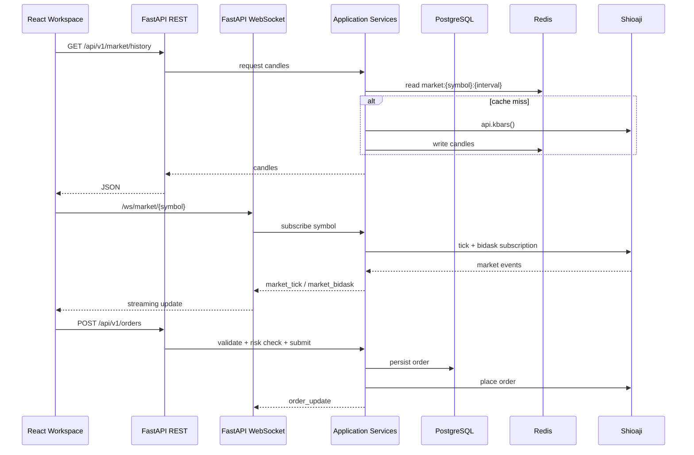

# Architecture Explanation

TTX Trader uses Clean Architecture so that trading rules and TAIFEX domain concepts remain independent from delivery mechanisms, broker SDK details, persistence engines, and UI frameworks.

## Backend Layers

1. **API / WebSocket adapters** (`backend/app/api`, `backend/app/websocket`)
   - FastAPI REST routers and WebSocket endpoints.
   - Convert HTTP/WebSocket payloads to application requests.
   - Return validated Pydantic V2 response schemas.

2. **Application services** (`backend/app/services`)
   - Coordinate Shioaji sessions, market data, order workflows, risk checks, ATM templates, and position operations.
   - Own transaction boundaries and publish WebSocket events.

3. **Domain** (`backend/app/domain`)
   - Broker-independent trading entities, value objects, invariants, and domain events.
   - Examples planned later: `Order`, `BracketOrder`, `AtmTemplate`, `RiskPolicy`, `Position`.

4. **Repositories / models** (`backend/app/repositories`, `backend/app/models`)
   - SQLAlchemy 2.0 persistence models and repository implementations.
   - Redis cache adapters for market data.

5. **Core infrastructure** (`backend/app/core`)
   - Settings, database session factory, logging, middleware, and cross-cutting configuration.

## Frontend Layers

1. **Pages** (`frontend/src/pages`)
   - Route-level workspace screens.
2. **Feature components** (`charts`, `dom`, `orders`, `positions`, `account`)
   - Tradovate-style trading widgets with isolated state and tests.
3. **Services / WebSocket clients** (`services`, `websocket`)
   - REST clients and streaming adapters.
4. **Stores and hooks** (`stores`, `hooks`)
   - Zustand state and React hooks for workspace layout, one-click trading, selected orders, and user preferences.
5. **Types / utils** (`types`, `utils`)
   - Shared TypeScript types and deterministic helpers.

## Runtime Flow

